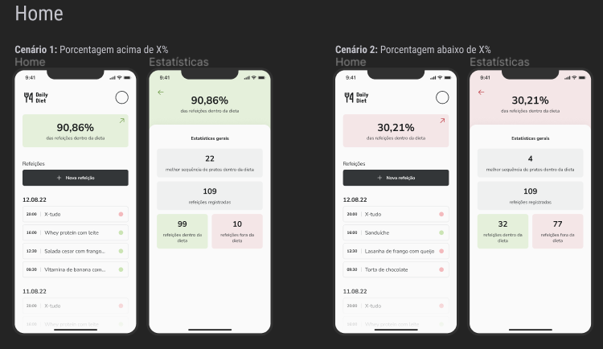
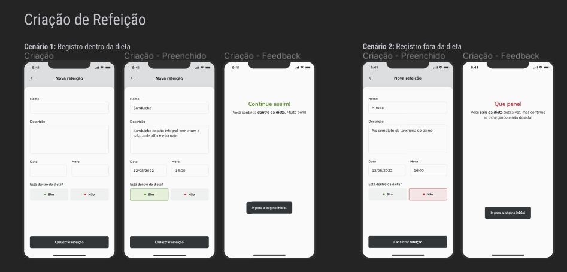
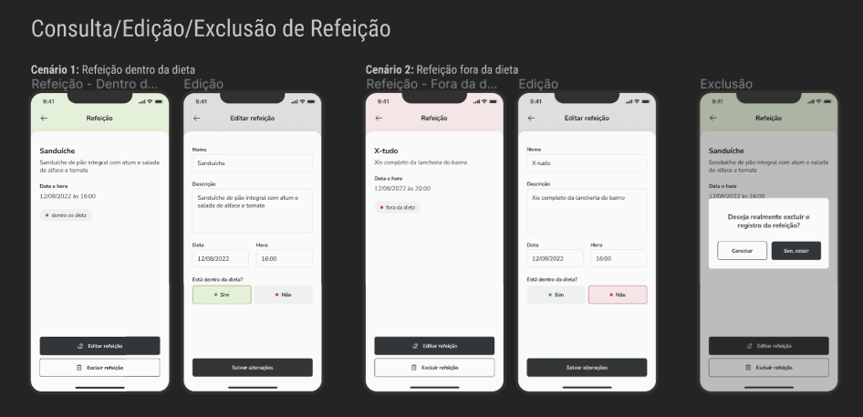

# Daily Diet

  

<h2>Descrição</h2>

Daily Diet é um aplicativo mobile para organizar e acompanhar suas dietas. 

  

  

  

<h3>Origem</h3>

Este é um desafio opcional da trilha Reac Native da Rocketseat.

<a href="https://www.figma.com/community/file/1218573349379609244">Layout Figma do Projeto</a>

<h2> Principais tecnologias envolvidas </h2>

- Typescript
- React Native
- Expo
- Styled-Components
- React Router
- react-native-async-storage

